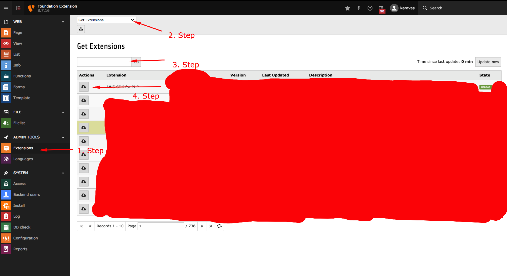
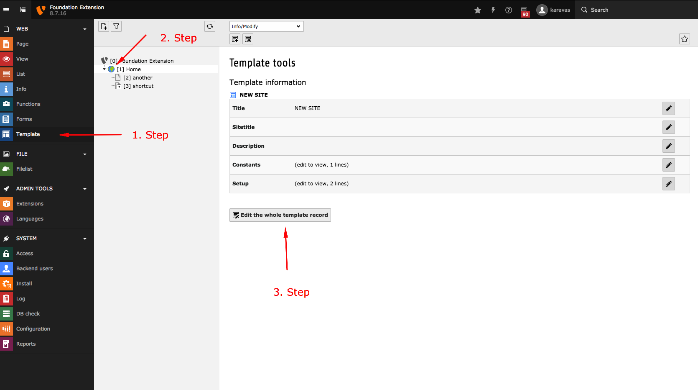
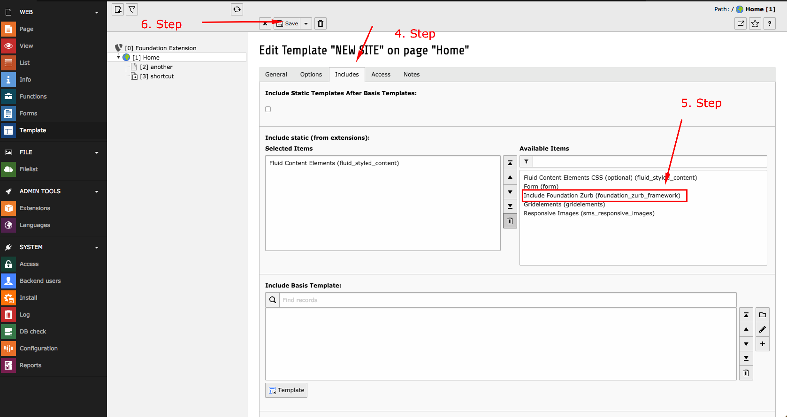

.. ==================================================
.. FOR YOUR INFORMATION
.. --------------------------------------------------
.. -*- coding: utf-8 -*- with BOM.

.. include:: ../../Includes.txt

.. _howToStartInstallation:

How to start
============
This walkthrough will help you to implement the extension foundation_zurb_framework at your
TYPO3 site.

.. only:: html

.. contents::
        :local:
        :depth: 1

.. _installation:

Installation
------------------

The extension needs to be installed as any other extension of TYPO3 CMS:

1. Switch on the **Extensions** module
2. On the upper left corner select the **"Get Extensions"** from the select menu
3. On the search bar, type: **foundation_zurb_framework**
4. Click on the cloud icon and download the extension

.. _preparation:

Preparation: Include static TypoScript
----------------------

The extension ships some TypoScript code which needs to be included.

1. Switch on the **Template module**
2. Go to your root page
3. Switch to the **Edit the whole template record**
4. Switch to the **Includes** tab
5. Choose the **Include Foundation Zurb** static template
6. Save and close your settings

Include PageTS
----------------------

The extension ships TSConfig too:

1. Switch to your root page
2. Edit the page
3. Switch to Resources
4. Include **Foundation Zurb - BackendLayouts (foundation_zurb_framework)**
5. Include **Foundation Zurb - PageTS (foundation_zurb_framework)**
6. Save

   
