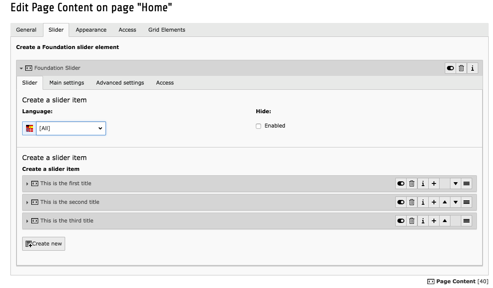
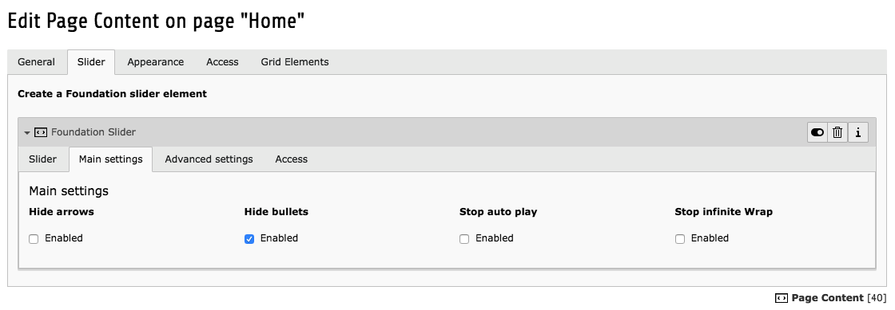
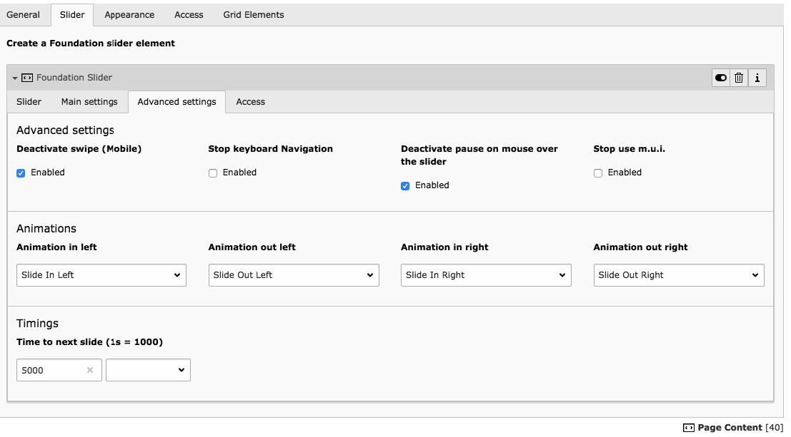

.. ==================================================
.. FOR YOUR INFORMATION
.. --------------------------------------------------
.. -*- coding: utf-8 -*- with BOM.

.. include:: ../../Includes.txt

.. _about:

What does it do?
================

Normally you would have to use another Extension to create your own content elements and apply frameworks on them. Now, with the foundation_zurb_framework extension, the content elements are already created for you and all you have to do is to add them on your website. 
You can also edit the Templates if you want. 
The content elements are inspired from `Foundation Zurb <https://foundation.zurb.com/>`_

.. _screenshots:

Screenshots
-----------

**Some content on the Slider content element**

**This is the slider's main settings**

**This is the slider's advanced settings**

