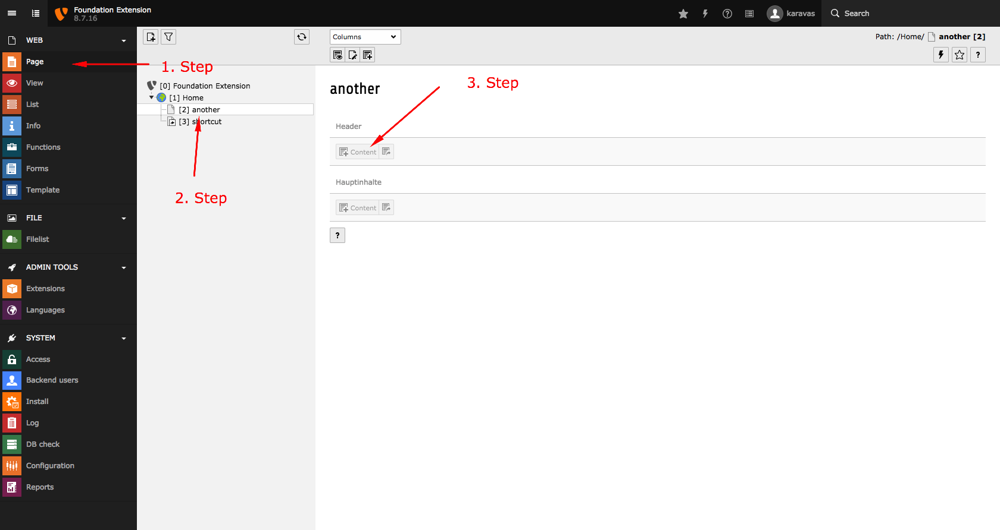
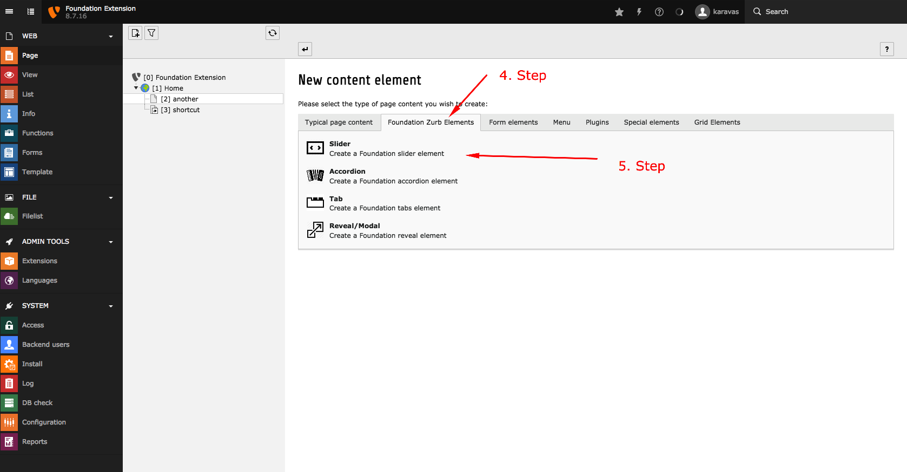

.. ==================================================
.. FOR YOUR INFORMATION
.. --------------------------------------------------
.. -*- coding: utf-8 -*- with BOM.

.. include:: ../../Includes.txt

.. _howToStart:

How to start
============
This walkthrough will help you to add a Foundation Zurb content element on your website

.. only:: html

.. contents::
        :local:
        :depth: 1

.. _installation:

Create an element
------------------

1. Switch on the **Page** module
2. Choose the page on the Pagetree that you would like the content element to be placed
3. Click on the content button to create a new content element
4. Switch to **Foundation Zurb Elements**
5. Choose your content element

   
